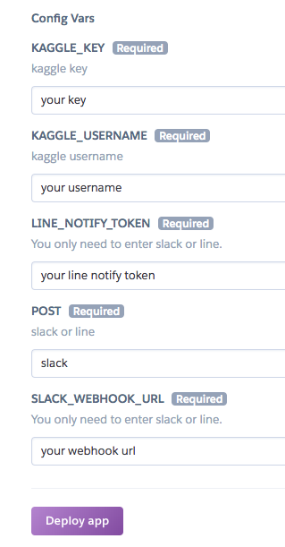
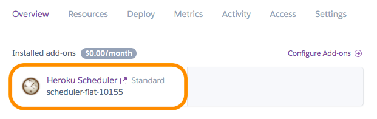
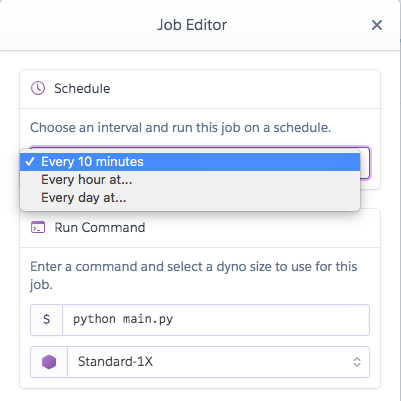
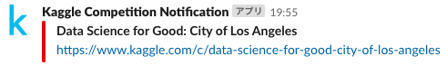
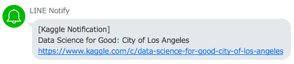

# Kaggle Competition Notification
[](https://heroku.com/deploy)

Notify new competition and remind one month, one week, three days, one day before the end of competition to Slack or LINE without coding.

## Requirements
- Kaggle API
- Heroku
- Credit card
    - It does not take money, to sign up and deploy heroku
- [Slack](https://api.slack.com/incoming-webhooks) or [LINE](https://notify-bot.line.me)

## Usage
### 1. Press button(`Deploy to Heroku`) and enter environment variables
You need to enter your credit card information to use [Heroku Scheduler](https://devcenter.heroku.com/articles/scheduler).  
Standard plan is free, so please don't worry.



### 2. Set task on Heroku


Set `FREQUENCY` with `Daily`.




```
now = datetime.datetime.utcnow()
if self.start_date >= now - datetime.timedelta(days=ONE_DAY):
    self.notify_message = NEW_COMPETITION

elif self.end_date <= now + datetime.timedelta(days=ONE_DAY):
    self.notify_message = ONE_DAY_BEFORE

elif self.end_date <= now + datetime.timedelta(days=THREE_DAYS) and self.end_date >= now + datetime.timedelta(days=THREE_DAYS-1):
    self.notify_message = THREE_DAYS_BEFORE

elif self.end_date <= now + datetime.timedelta(days=ONE_WEEK) and self.end_date >= now + datetime.timedelta(days=ONE_WEEK-1):
    self.notify_message = ONE_WEEK_BEFORE

elif self.end_date <= now + datetime.timedelta(days=ONE_MONTH) and self.end_date >= now + datetime.timedelta(days=ONE_MONTH-1):
    self.notify_message = ONE_MONTH_BEFORE

else:
    self.notify_message = DO_NOT_NOTIFY
```

If you get at short intervals or change the schedule to remind, please fork and correct the program.

## Sample
- Slack



- LINE



## Contribution
Welcome issue and pull request.

## License
MIT

## Author
Doarakko